# KAVYA KANAJA
## Enterprise-Grade Digital Archive for Kannada Literature

### Executive Summary
Kavya Kanaja is a sophisticated mobile platform engineered for the preservation and dissemination of Kannada poetic heritage. The application leverages modern Android development paradigms to provide an immersive, high-fidelity experience for literary exploration. It is designed to bridge the gap between traditional literature and modern digital accessibility.

### Visual Interface
The following screenshots provide a comprehensive overview of the application's user interface, including the authentication flow, home dashboard, content exploration, interactive quiz, and media playback.

| | | |
| :---: | :---: | :---: |
|  | 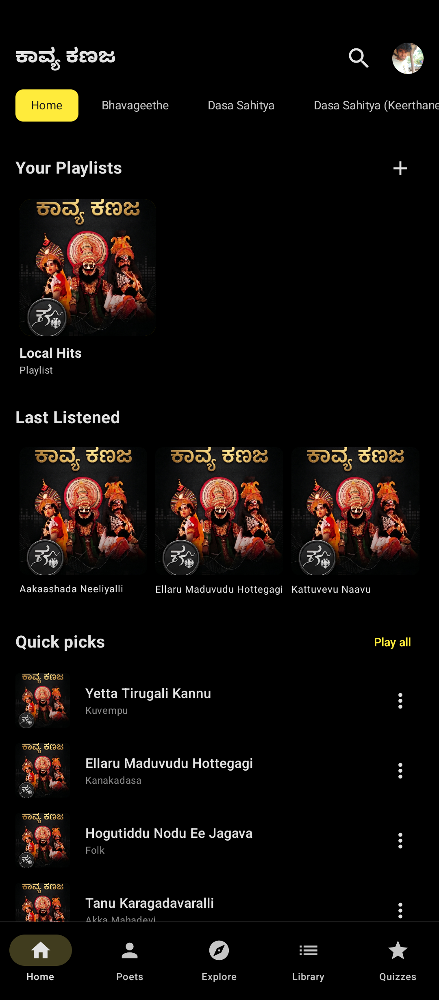 | 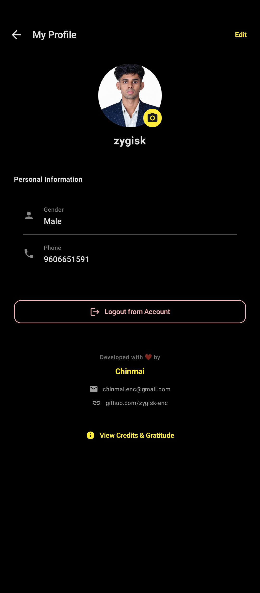 |
| 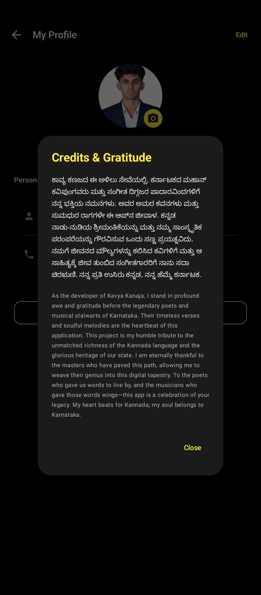 |  | 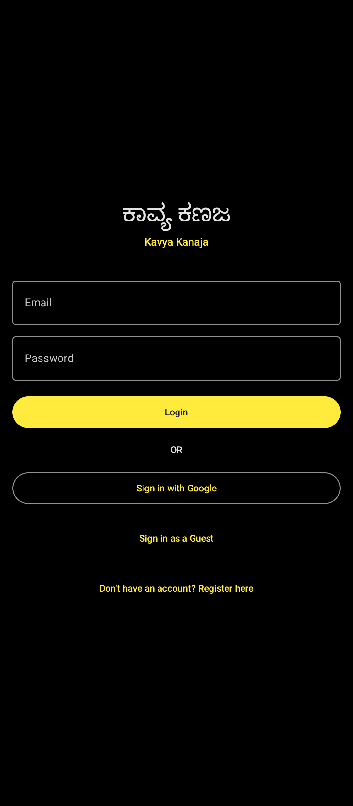 |
| 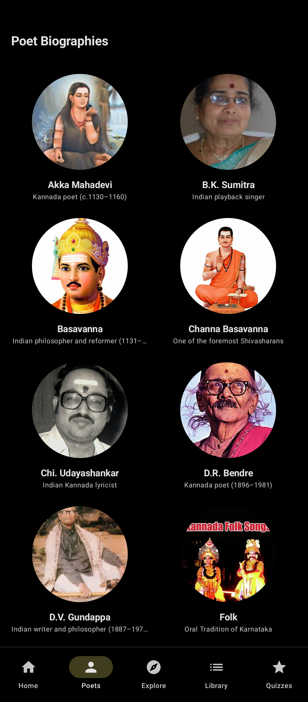 | 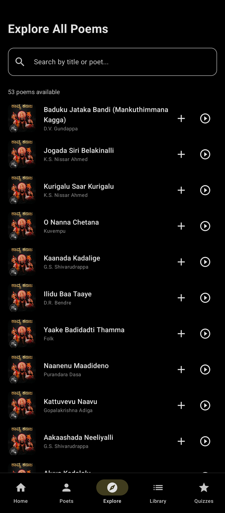 | 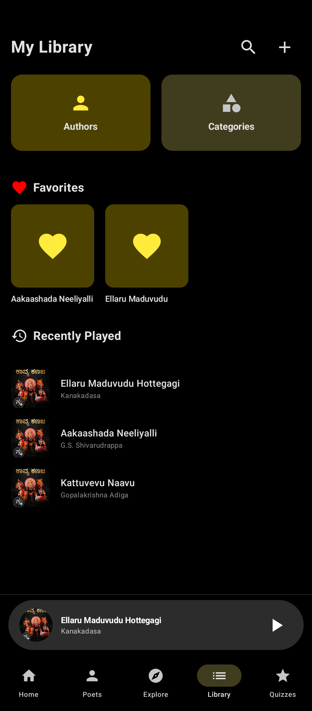 |
| 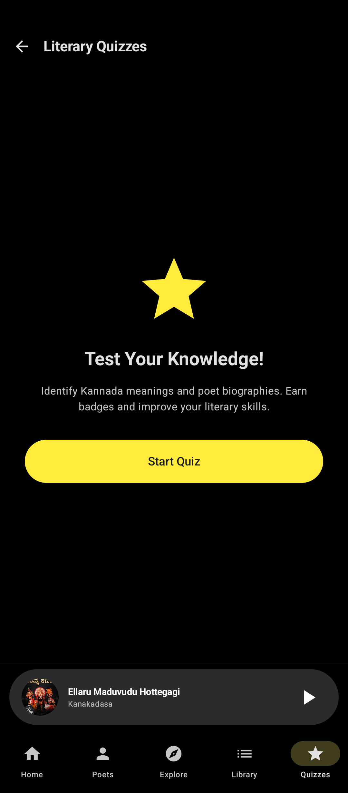 | 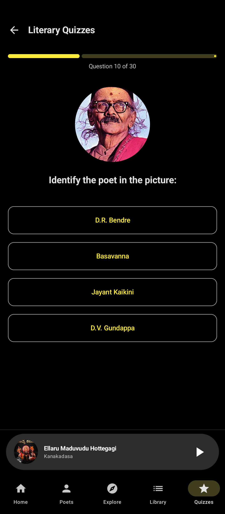 | 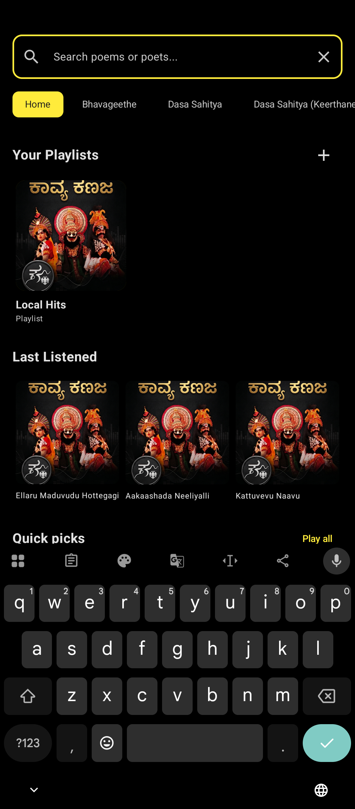 |
| 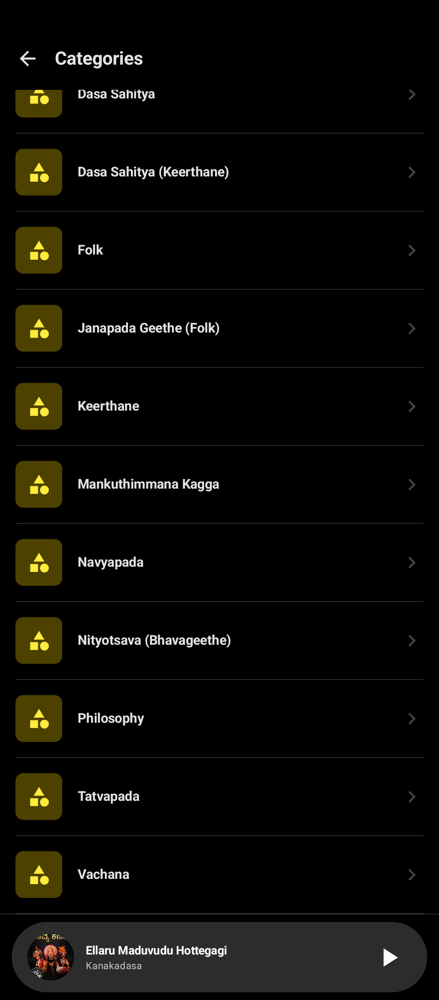 | 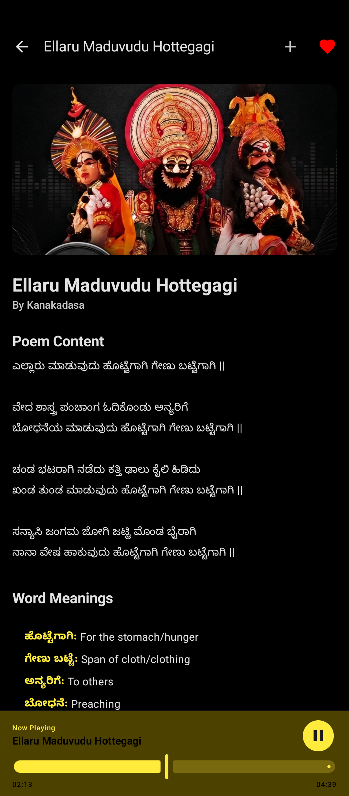 | |

### System Architecture
The codebase adheres to Clean Architecture principles, ensuring a strict separation of concerns through the MVVM (Model-View-ViewModel) design pattern. This architecture facilitates scalability, rigorous testing, and long-term maintainability.

#### Presentation Layer
- UI Framework: Jetpack Compose (Declarative UI)
- Design System: Material 3 (M3)
- State Management: ViewModels with StateFlow/SharedFlow
- Navigation: Type-safe Compose Navigation implementation

#### Domain Layer
- Business Logic: Independent domain entities (Poem, PoetBio)
- Use Cases: Dedicated logic for playback history and playlist management

#### Data Layer
- Local Persistence: Room Database with SQLite backing
- Cloud Integration: Firebase Authentication and Real-time data sync
- Media Engine: AndroidX Media3 (ExoPlayer) for optimized audio streaming

### Technical Specifications
| Category | Technology |
| :--- | :--- |
| Programming Language | Kotlin 2.1 |
| UI Framework | Jetpack Compose |
| Database | Room / SQLite |
| Authentication | Firebase Auth |
| Audio Engine | Media3 / ExoPlayer |
| Build System | Gradle (Kotlin DSL) |

### Key Features
#### Persistent Audio Recitations
Implementation of a dedicated foreground service enables continuous audio playback. This architecture ensures the playback state remains consistent across the entire application lifecycle, including background transitions and device lock states.

#### Historical Context and Biographies
A comprehensive, cross-referenced database of poet biographies provides users with critical historical and literary context for each archived work.

#### Advanced Content Discovery
A multi-dimensional filtering and search system allows users to categorize works by historical period, author, or genre with low latency.

#### Personalization and Library Management
Robust local management of user-defined playlists, favorited content, and chronological listening history, synchronized with the user's profile.

### Installation and Deployment
#### Development Requirements
- Android SDK 34 (Upside Down Cake) or higher
- Java Development Kit (JDK) 17
- Android Studio Ladybug (2024.2.1) or newer

#### Build Process
1. Clone the repository: `git clone https://github.com/zygisk-enc/Kavya_kanaja.git`
2. Insert `google-services.json` into the `/app` directory.
3. Build the release bundle: `./gradlew assembleRelease`

### Engineering Standards and Compliance
This project maintains industry-standard code quality through:
- Strict adherence to Google's Android and Kotlin coding conventions.
- Static analysis and linting via ktlint.
- Modularized project structure for decoupled development.
- Comprehensive Git history following Conventional Commits.

### License
This software is licensed under the MIT License. Copyright (c) 2026 Zygisk.

---
__Dedicated to the digital preservation of Kannada's poetic legacy.__
